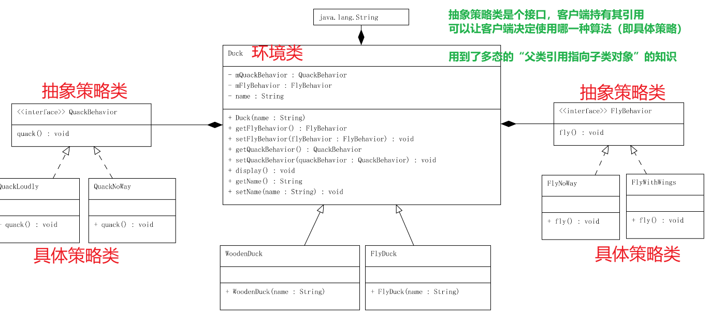

# 策略模式 Strategy Pattern
> 策略模式(Strategy Pattern)：定义一系列算法，将每一个算法封装起来，并让它们可以相互替换.

`可以互相替换`可以解释为：这一系列算法要实现相似的功能，但是实现细节又有所差异，客户端需要根据实际情况来选择相应的最适合的算法。
这时，需要一个统一的管理者来管理这一系列算法，由此便想到了`接口`,这一系列算法只需分别实现这个接口即可。

## 1. 策略模式的组成部分
- Context: 环境类 
- Strategy: 抽象策略类 
- ConcreteStrategy: 具体策略类

## 2. 优缺点
> 优点
1. 策略模式提供了对“开闭原则”的完美支持，用户可以在不修改原有系统的基础上选择算法或行为，也可以灵活地增加新的算法或行为。
2. 策略模式提供了管理相关的算法族的办法。
3. 策略模式提供了可以替换继承关系的办法。
4. 使用策略模式可以避免使用多重条件转移语句。

> 缺点
1. 客户端必须知道所有的策略类，并自行决定使用哪一个策略类。
2. 策略模式将造成产生很多策略类，可以通过使用享元模式在一定程度上减少对象的数量。

## 3. 适用场景
1. 如果在一个系统里面有许多类，它们之间的区别仅在于它们的行为，那么使用策略模式可以动态地让一个对象在许多行为中选择一种行为。
2. 一个系统需要动态地在几种算法中选择一种。
3. 如果一个对象有很多的行为，如果不用恰当的模式，这些行为就只好使用多重的条件选择语句来实现。
4. 不希望客户端知道复杂的、与算法相关的数据结构，在具体策略类中封装算法和相关的数据结构，提高算法的保密性与安全性。