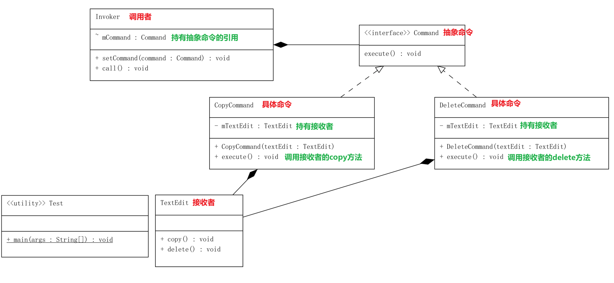
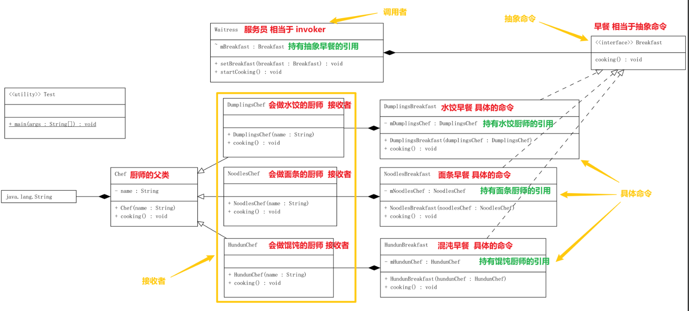

# 命令模式 Command Pattern

> 命令模式(Command Pattern)：将一个请求封装为一个对象，从而使我们可用不同的请求对客户进行参数化；对请求排队或者记录请求日志，以及支持可撤销的操作

命令模式可以对发送者和接收者完全解耦，发送者与接收者之间没有直接引用关系，发送请求的对象只需要知道如何发送请求，而不必知道如何完成请求.

    发送者只需要发送命令，接收者通过命令集合来完成命令。

## 1. 命令模式的组成部分
* Command: 抽象命令类
* ConcreteCommand: 具体命令类
* Invoker: 调用者
* Receiver: 接收者
* Client:客户类（测试类）

**Demo One**

**Demo Two**

## 2. 优缺点
> 优点
1. 降低系统的耦合度。
2. 新的命令可以很容易地加入到系统中。
3. 可以比较容易地设计一个命令队列和宏命令（组合命令）。
4. 可以方便地实现对请求的Undo和Redo。

> 缺点
1. 使用命令模式可能会导致某些系统有过多的具体命令类。因为针对每一个命令都需要设计一个具体命令类，因此某些系统可能需要大量具体命令类，这将影响命令模式的使用。

## 3. 适用场景
1. 系统需要将请求调用者和请求接收者解耦，使得调用者和接收者不直接交互。
2. 系统需要在不同的时间指定请求、将请求排队和执行请求。
3. 系统需要支持命令的撤销(Undo)操作和恢复(Redo)操作。
4. 系统需要将一组操作组合在一起，即支持宏命令